# 2023-10-27 Hands-on workshop 指南

" 10/27 探索未來對話式科技 " ☁ 親手帶你做智慧語音助理：輕鬆上手 Amazon Lex 工作坊 ☁

首先謝謝大家來到今天的工作坊，我們為了讓大家能更愉快的體驗工作坊的內容，我們設計了本次的工作坊指南，不過還是要提醒大家！工作坊內容還是以台上簡報為主，以下內容可以輔助大家更快跟上進度，以及複製工作坊相對應所需內容！

讓我們一起體驗智慧語音助理帶來的樂趣吧！

## Lambda Setup

### Lambda Jeopardy Game Information
| Configuration | Content | Figure |
|:-:|:-:|:-:|
| Function Name | Jeopardy_game | 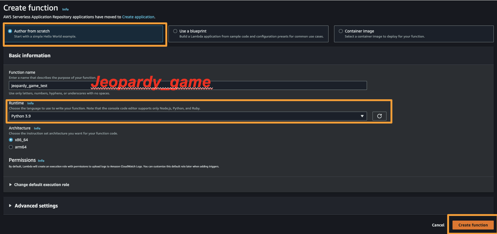|
| Runtime | Python 3.9 | |

### `Python` Source Code
```python
import json
import random
import requests

""" --- Helpers to call jService (https://jservice.io/) --- """

def get_question(category):

    id = {
        'Pop Music' : 2,
        'Sport' : 81,
        'Geography' : 158
    }

    try:
        payload = { 'id' : str(id[category]) }
        url = 'https://jservice.io/api/category'
        r = requests.get(url, params=payload)
        questions = r.json()['clues']
        q = random.choice(questions)
        return q['question'] + '  →  ' + q['answer']
    except:
        return 'Oops! Our question set is out of service. Please try it later.'

""" --- Main handler --- """

def lambda_handler(event, context):

    intent_name = event['interpretations'][0]['intent']['name']
    slots = event['interpretations'][0]['intent']['slots']
    category = slots['CategoryName']['value']['interpretedValue']
    message = get_question(category)

    response = {
       'sessionState' : {
            'dialogAction' : {
                'type' : 'Close'
            },
            'intent' : {
                'name' : intent_name,
                'state' : 'Fulfilled'
            }
       },
        'messages': [
             {
                'contentType' : 'PlainText',
                'content' : message
             }
        ]
    }

    return response
```

### GeoEvent `JSON` Source Code

- Test Event Action: Create new event
- Event name: `GeoEvent`

```js
{
    "interpretations": [
        {
            "intent": {
                "slots": {
                    "CategoryName": {
                        "value": {
                            "interpretedValue": "Geography"
                        }
                    }
                },
                "name": "PlayNewRound"
            }
        }
    ]
}
```

### Create Lambda Layer

| Configuration | Content | Figure |
|:-:|:-:|:-:|
| layer Name | jeopardy_request | 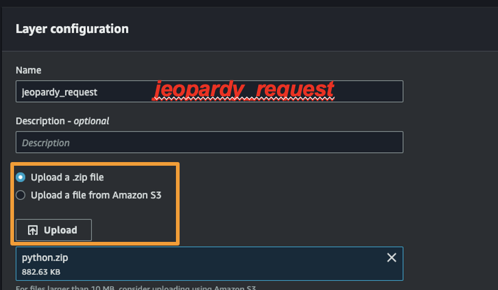 <br> 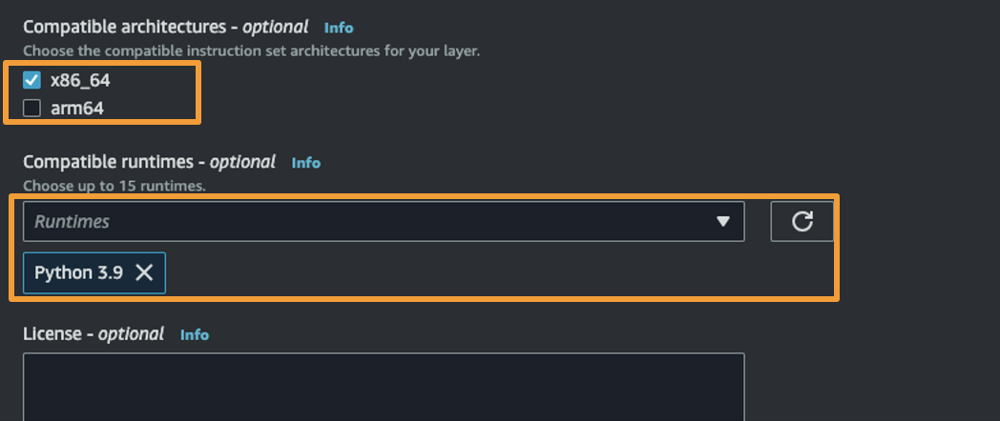|

## Lex setup

### Bot Configuration

| Configuration | Content | Figure |
|:-:|:-:|:-:|
| Bot Name | Jeopardy_2023_1027 | 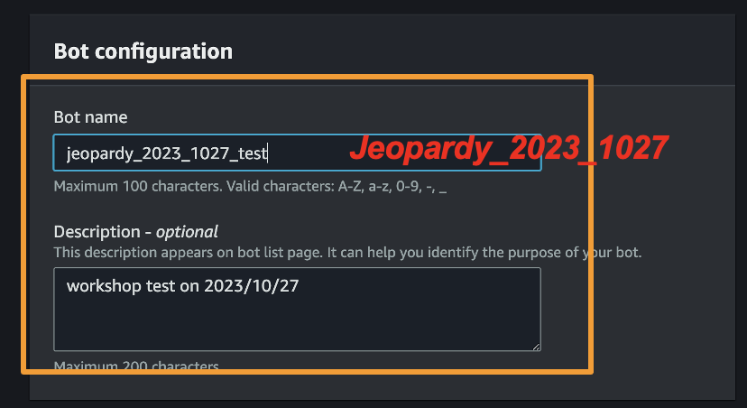 |
| Descriptions | 2023-10-27 workshop demo | |
| Runtime Role | Create a role with basic Amazon Lex permissions | 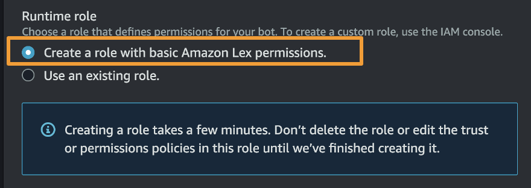 |
| COPPA(Children's Online Privacy Protection Act) |  Create a role with basic Amazon Lex permissions |  |
| Language | English (US) | 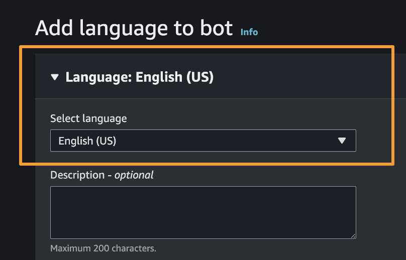 |
| Voice Interaction | Danielle | 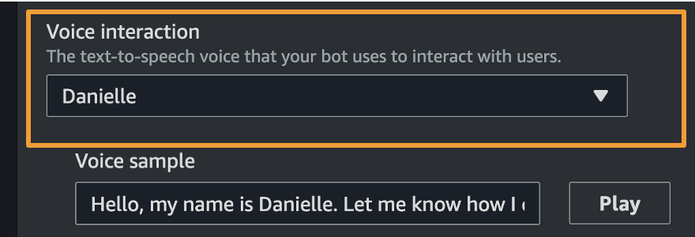 |
| Intent Classifaction Confidence Score Threshold | 0.4 | 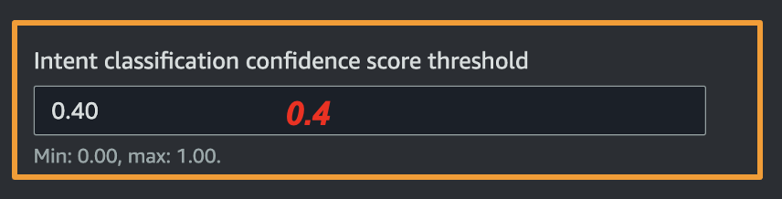 |

### Lex Jeopardy Game Configuration

| Intent | Utterances | Initial Response |
|:-:|:-:|:-:|
| play_new_round | 1. Let’s play the Jeopardy! <br>2. Start a Jeopardy <br>3. Have fun with Jeopardy. | Okay, let’s have fun! |
| 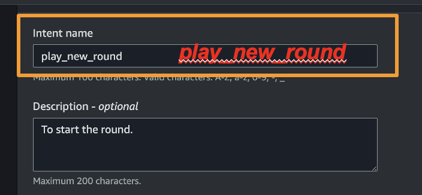 | 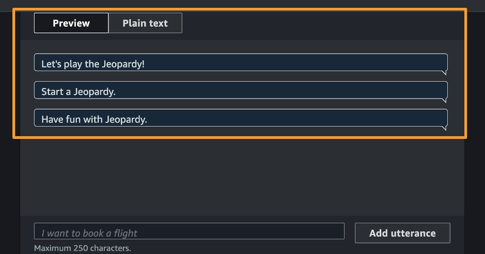 | 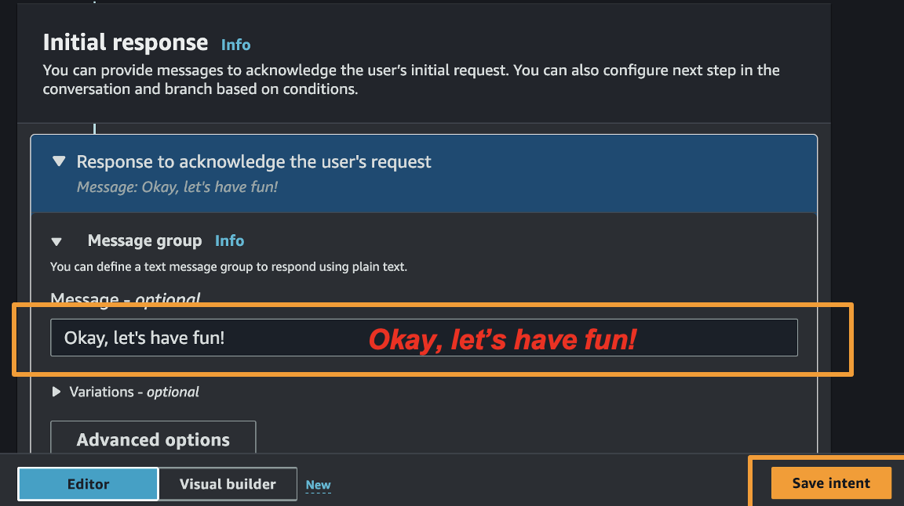|
| check_score | 1. grade <br>2. my score <br>3. my score | checking score is not abaliable |
| 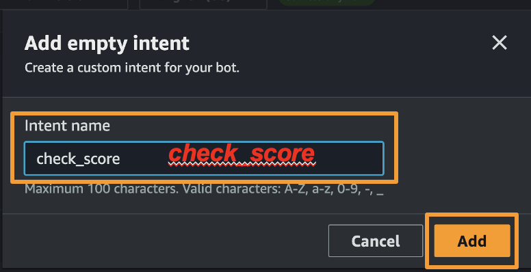 | 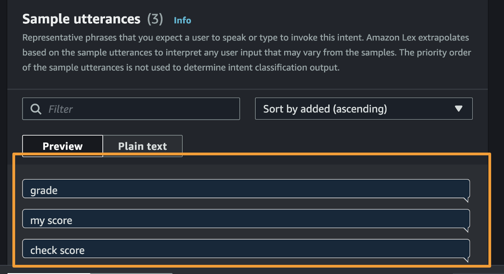 | 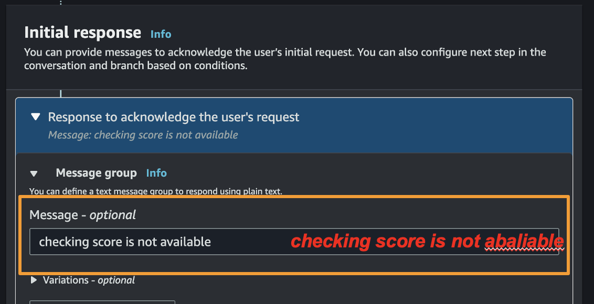 |

### Lex Jeopardy Game Slot Configuration

#### Slot Type
| Configuration | Content |
|:-:|:-:|
| Type Name | Category |
| Restrict to Slot values | Yes |

#### Slot Type Value
| Slot Type Value |     Synonyms     |
|:-------------:|:--------------:|
| Pop music | 1. Music <br>2. music <br>3. Pop |
| Sport | 1. sport <br>2. exercise  |
| Geography | 1. landscape <br>2. geography <br>3. landmark |

#### Lex Jeopardy Game Add Slot Configuration
| Slot Type Value |     Synonyms     |
|:-------------:|:--------------:|
| Name | CategoryName |
| Slot Type | Category  |
| Prompts | Choose you question type |

#### Lex Jeopardy Game Confirmation Configuration
| Confirmation Prompt |     Decline Response     |
|:-------------:|:--------------:|
| On Successful fulfillment | ok,preparing {CategoryName} question |

#### Lex Jeopardy Game Fulfillment Configuration


## CONTACT INFO.

> AWS Educate Cloud Ambassador, Technical Support </br>
> **Hugo ChunHo Lin**
> 
> <aside>
>   📩 <a href="mailto:hugo970217@gmail.com">hugo970217@gmail.com</a>
> </aside>

## License
Released under [MIT](./LICENSE) by [AWS Educate TW](https://aws.amazon.com/tw/education/awseducate/), [Hugo ChunHo Lin](https://github.com/1chooo).

This software can be modified and reused without restriction.
The original license must be included with any copies of this software.
If a significant portion of the source code is used, please provide a link back to this repository.